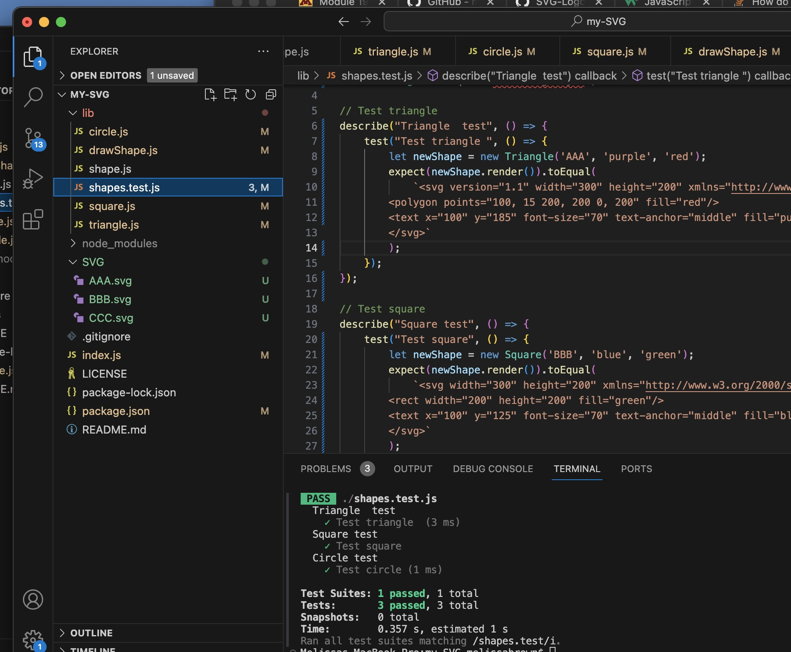
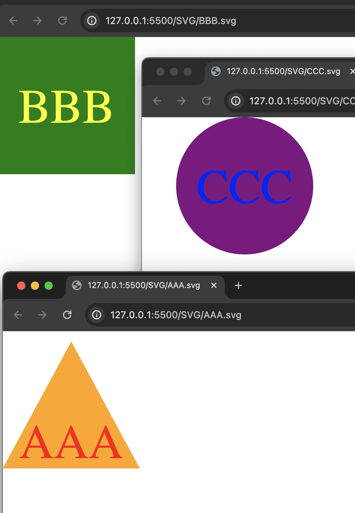

  # my-SVG
  A Node.js command-line application that takes in user input to generate a logo and save it as  an SVG file

  # Description
  AS a freelance web developer
  I WANT to generate a simple logo for my projects
  SO THAT I don't have to pay a graphic designer

  ## Table of Contents

  [Description](#description) | [License](#license) | [Questions](#questions)

  SVG jest test pass and SVG created

  

  SVG in broswer

  

  ## License
  
  License: MIT

  
  
  ## Questions

  GitHub username: mbrown50

  GitHub Repo: https://github.com/mbrown50/my-SVG

  Video: https://drive.google.com/file/d/17CmAY6uvZSofQ-Udou2a5Ayw6Gogy59R/view?usp=sharing
  